# 📐 ML Metrics — The Definitive Reference

**Debug model internals. Select the right metric. Understand what each metric reveals — and where it breaks.**

A dense, single-source reference covering **58 metrics** across eight domains: tensor-level numerical debugging, regression, classification, object detection, segmentation, generative/distribution quality, ranking & retrieval, and calibration & uncertainty.

---

## Who This Is For

ML engineers who need to:

- **Debug model internals** — layer outputs, quantization drift, activation distributions, numerical precision across dtype casts.
- **Select the right metric** — not from a blog post, but from a structured comparison with failure modes, edge cases, and code.
- **Understand what each metric reveals and fails at** — sensitivity to outliers, behaviour on imbalanced data, invariance properties, computational cost.

If you already know what a confusion matrix is, you're in the right place.

---

## Table of Contents

### Tensor Comparison & Numerical Debugging (11 metrics)

| # | Metric | Path |
|---|--------|------|
| 1 | Cosine Similarity | [cosine_similarity.md](./docs/metrics/tensor-comparison/cosine_similarity.md) |
| 2 | RMSE | [rmse.md](./docs/metrics/tensor-comparison/rmse.md) |
| 3 | RRMSE | [rrmse.md](./docs/metrics/tensor-comparison/rrmse.md) |
| 4 | MAE | [mae.md](./docs/metrics/tensor-comparison/mae.md) |
| 5 | torch.allclose / isclose | [allclose.md](./docs/metrics/tensor-comparison/allclose.md) |
| 6 | SNR | [snr.md](./docs/metrics/tensor-comparison/snr.md) |
| 7 | SQNR | [sqnr.md](./docs/metrics/tensor-comparison/sqnr.md) |
| 8 | KL Divergence | [kl_divergence.md](./docs/metrics/tensor-comparison/kl_divergence.md) |
| 9 | L1 / L2 Norm Difference | [norm_difference.md](./docs/metrics/tensor-comparison/norm_difference.md) |
| 10 | Max Absolute Error | [max_absolute_error.md](./docs/metrics/tensor-comparison/max_absolute_error.md) |
| 11 | Pearson / Spearman Correlation | [correlation.md](./docs/metrics/tensor-comparison/correlation.md) |

### General Regression (7 metrics)

| # | Metric | Path |
|---|--------|------|
| 1 | MSE | [mse.md](./docs/metrics/regression/mse.md) |
| 2 | RMSE | [rmse.md](./docs/metrics/regression/rmse.md) |
| 3 | MAE | [mae.md](./docs/metrics/regression/mae.md) |
| 4 | MAPE | [mape.md](./docs/metrics/regression/mape.md) |
| 5 | R² | [r_squared.md](./docs/metrics/regression/r_squared.md) |
| 6 | Huber Loss | [huber_loss.md](./docs/metrics/regression/huber_loss.md) |
| 7 | SMAPE | [smape.md](./docs/metrics/regression/smape.md) |

### Classification (10 metrics)

| # | Metric | Path |
|---|--------|------|
| 1 | Accuracy | [accuracy.md](./docs/metrics/classification/accuracy.md) |
| 2 | Precision | [precision.md](./docs/metrics/classification/precision.md) |
| 3 | Recall | [recall.md](./docs/metrics/classification/recall.md) |
| 4 | F1 Score | [f1_score.md](./docs/metrics/classification/f1_score.md) |
| 5 | ROC-AUC | [roc_auc.md](./docs/metrics/classification/roc_auc.md) |
| 6 | PR-AUC | [pr_auc.md](./docs/metrics/classification/pr_auc.md) |
| 7 | MCC | [mcc.md](./docs/metrics/classification/mcc.md) |
| 8 | Cohen's Kappa | [cohens_kappa.md](./docs/metrics/classification/cohens_kappa.md) |
| 9 | Specificity | [specificity.md](./docs/metrics/classification/specificity.md) |
| 10 | Top-K Accuracy | [top_k_accuracy.md](./docs/metrics/classification/top_k_accuracy.md) |

### Object Detection (6 metrics)

| # | Metric | Path |
|---|--------|------|
| 1 | mAP | [map.md](./docs/metrics/object-detection/map.md) |
| 2 | IoU | [iou.md](./docs/metrics/object-detection/iou.md) |
| 3 | GIoU | [giou.md](./docs/metrics/object-detection/giou.md) |
| 4 | DIoU | [diou.md](./docs/metrics/object-detection/diou.md) |
| 5 | CIoU | [ciou.md](./docs/metrics/object-detection/ciou.md) |
| 6 | Average Recall | [average_recall.md](./docs/metrics/object-detection/average_recall.md) |

### Segmentation (4 metrics)

| # | Metric | Path |
|---|--------|------|
| 1 | Dice Coefficient | [dice.md](./docs/metrics/segmentation/dice.md) |
| 2 | IoU (Jaccard) | [iou.md](./docs/metrics/segmentation/iou.md) |
| 3 | Pixel Accuracy | [pixel_accuracy.md](./docs/metrics/segmentation/pixel_accuracy.md) |
| 4 | Boundary F1 | [boundary_f1.md](./docs/metrics/segmentation/boundary_f1.md) |

### Generative & Distribution Quality (10 metrics)

| # | Metric | Path |
|---|--------|------|
| 1 | FID | [fid.md](./docs/metrics/generative/fid.md) |
| 2 | Inception Score | [inception_score.md](./docs/metrics/generative/inception_score.md) |
| 3 | LPIPS | [lpips.md](./docs/metrics/generative/lpips.md) |
| 4 | SSIM | [ssim.md](./docs/metrics/generative/ssim.md) |
| 5 | PSNR | [psnr.md](./docs/metrics/generative/psnr.md) |
| 6 | BLEU | [bleu.md](./docs/metrics/generative/bleu.md) |
| 7 | ROUGE | [rouge.md](./docs/metrics/generative/rouge.md) |
| 8 | METEOR | [meteor.md](./docs/metrics/generative/meteor.md) |
| 9 | CIDEr | [cider.md](./docs/metrics/generative/cider.md) |
| 10 | BERTScore | [bertscore.md](./docs/metrics/generative/bertscore.md) |

### Ranking & Retrieval (5 metrics)

| # | Metric | Path |
|---|--------|------|
| 1 | NDCG | [ndcg.md](./docs/metrics/ranking/ndcg.md) |
| 2 | MRR | [mrr.md](./docs/metrics/ranking/mrr.md) |
| 3 | Precision@K | [precision_at_k.md](./docs/metrics/ranking/precision_at_k.md) |
| 4 | Recall@K | [recall_at_k.md](./docs/metrics/ranking/recall_at_k.md) |
| 5 | MAP@K | [map_at_k.md](./docs/metrics/ranking/map_at_k.md) |

### Calibration & Uncertainty (5 metrics)

| # | Metric | Path |
|---|--------|------|
| 1 | ECE | [ece.md](./docs/metrics/calibration/ece.md) |
| 2 | MCE | [mce.md](./docs/metrics/calibration/mce.md) |
| 3 | Reliability Diagrams | [reliability_diagrams.md](./docs/metrics/calibration/reliability_diagrams.md) |
| 4 | Brier Score | [brier_score.md](./docs/metrics/calibration/brier_score.md) |
| 5 | NLL | [nll.md](./docs/metrics/calibration/nll.md) |

---

## Metric Selection Flowchart

```mermaid
flowchart TD
    A["What are you measuring?"] --> B{"Comparing tensors directly\n(debugging / validation)"}
    A --> C{"Evaluating model outputs\n(task performance)"}

    B --> B1{"What matters most?"}
    B1 -->|"Direction / shape"| B1a["**Cosine Similarity**"]
    B1 -->|"Magnitude of error"| B1b{"Sensitive to outliers?"}
    B1b -->|Yes| B1b1["**MAE** or **L1 Norm Diff**"]
    B1b -->|No| B1b2["**RMSE** or **L2 Norm Diff**"]
    B1 -->|"Worst-case deviation"| B1c["**Max Absolute Error**"]
    B1 -->|"Signal preservation"| B1d{"Quantization context?"}
    B1d -->|Yes| B1d1["**SQNR**"]
    B1d -->|No| B1d2["**SNR**"]
    B1 -->|"Distribution shift"| B1e["**KL Divergence**"]
    B1 -->|"Pass/fail tolerance"| B1f["**torch.allclose**"]
    B1 -->|"Monotonic relationship"| B1g["**Pearson / Spearman**"]

    C --> C1{"Output type?"}
    C1 -->|"Continuous"| C2{"Care about outliers?"}
    C2 -->|Yes| C2a["**MAE**, **Huber Loss**, **SMAPE**"]
    C2 -->|No| C2b["**MSE**, **RMSE**, **R²**"]
    C2 -->|"Relative error"| C2c["**MAPE**, **RRMSE**"]

    C1 -->|"Categorical"| C3{"Data imbalanced?"}
    C3 -->|Yes| C3a["**F1**, **PR-AUC**, **MCC**"]
    C3 -->|No| C3b["**Accuracy**, **ROC-AUC**, **Cohen's Kappa**"]
    C3 -->|"Multi-class ranking"| C3c["**Top-K Accuracy**"]

    C1 -->|"Probabilistic"| C4["**ECE**, **Brier Score**, **NLL**\n+ Reliability Diagrams"]

    C1 -->|"Bounding boxes"| C5["**mAP**, **IoU** variants\n(**GIoU / DIoU / CIoU**)"]
    C1 -->|"Pixel masks"| C6["**Dice**, **IoU (Jaccard)**,\n**Boundary F1**"]
    C1 -->|"Generated images"| C7["**FID**, **IS**, **LPIPS**,\n**SSIM**, **PSNR**"]
    C1 -->|"Generated text"| C8["**BLEU**, **ROUGE**, **METEOR**,\n**CIDEr**, **BERTScore**"]
    C1 -->|"Ranked lists"| C9["**NDCG**, **MRR**,\n**Precision@K**, **MAP@K**"]

    style A fill:#0f1a10,stroke:#22c55e,color:#22c55e
    style B fill:#111,stroke:#22c55e,color:#e8e8e8
    style C fill:#111,stroke:#22c55e,color:#e8e8e8
    style B1a fill:#0f1a10,stroke:#16a34a,color:#22c55e
    style B1b1 fill:#0f1a10,stroke:#16a34a,color:#22c55e
    style B1b2 fill:#0f1a10,stroke:#16a34a,color:#22c55e
    style B1c fill:#0f1a10,stroke:#16a34a,color:#22c55e
    style B1d1 fill:#0f1a10,stroke:#16a34a,color:#22c55e
    style B1d2 fill:#0f1a10,stroke:#16a34a,color:#22c55e
    style B1e fill:#0f1a10,stroke:#16a34a,color:#22c55e
    style B1f fill:#0f1a10,stroke:#16a34a,color:#22c55e
    style B1g fill:#0f1a10,stroke:#16a34a,color:#22c55e
    style C2a fill:#0f1a10,stroke:#16a34a,color:#22c55e
    style C2b fill:#0f1a10,stroke:#16a34a,color:#22c55e
    style C2c fill:#0f1a10,stroke:#16a34a,color:#22c55e
    style C3a fill:#0f1a10,stroke:#16a34a,color:#22c55e
    style C3b fill:#0f1a10,stroke:#16a34a,color:#22c55e
    style C3c fill:#0f1a10,stroke:#16a34a,color:#22c55e
    style C4 fill:#0f1a10,stroke:#16a34a,color:#22c55e
    style C5 fill:#0f1a10,stroke:#16a34a,color:#22c55e
    style C6 fill:#0f1a10,stroke:#16a34a,color:#22c55e
    style C7 fill:#0f1a10,stroke:#16a34a,color:#22c55e
    style C8 fill:#0f1a10,stroke:#16a34a,color:#22c55e
    style C9 fill:#0f1a10,stroke:#16a34a,color:#22c55e
```

<div class="diagram">
<div class="diagram-title">Which metric do you need?</div>
</div>



---

## Quick-Start Paths

### 🅰 "I'm debugging quantization"

Your FP32 → INT8 outputs diverge. Start here:

| Step | Metric | Why |
|------|--------|-----|
| 1 | [SQNR](./docs/metrics/tensor-comparison/sqnr.md) | Measures signal-to-quantization-noise ratio — the single best summary stat for quantization fidelity. |
| 2 | [Cosine Similarity](./docs/metrics/tensor-comparison/cosine_similarity.md) | Detects directional drift even when magnitudes are rescaled. |
| 3 | [Max Absolute Error](./docs/metrics/tensor-comparison/max_absolute_error.md) | Finds the worst-case per-element deviation — critical for overflow/clipping. |
| 4 | [KL Divergence](./docs/metrics/tensor-comparison/kl_divergence.md) | Compares activation distributions pre/post quantization. |
| 5 | [Quantization Debugging Playbook](./docs/playbooks/quantization_debugging.md) | End-to-end workflow combining these metrics per layer. |

### 🅱 "I need classification metrics"

Evaluating a classifier. Pick your entry point by data characteristics:

| Scenario | Start With |
|----------|------------|
| Balanced classes | [Accuracy](./docs/metrics/classification/accuracy.md), [ROC-AUC](./docs/metrics/classification/roc_auc.md) |
| Imbalanced classes | [F1 Score](./docs/metrics/classification/f1_score.md), [PR-AUC](./docs/metrics/classification/pr_auc.md) |
| Need a single robust number | [MCC](./docs/metrics/classification/mcc.md) |
| Threshold-independent ranking | [ROC-AUC](./docs/metrics/classification/roc_auc.md), [PR-AUC](./docs/metrics/classification/pr_auc.md) |

### 🅲 "I'm evaluating generative models"

Image or text generation quality:

| Domain | Metrics |
|--------|---------|
| Image quality (distributional) | [FID](./docs/metrics/generative/fid.md) |
| Image quality (perceptual, per-pair) | [SSIM](./docs/metrics/generative/ssim.md), [LPIPS](./docs/metrics/generative/lpips.md) |
| Text (n-gram overlap) | [BLEU](./docs/metrics/generative/bleu.md), [ROUGE](./docs/metrics/generative/rouge.md) |
| Text (semantic similarity) | [BERTScore](./docs/metrics/generative/bertscore.md) |

---

## Repository Map

```text
metrics/
├── README.md                          ← you are here
├── _config.yml                        ← Jekyll / GitHub Pages config
├── _layouts/
│   └── default.html                   ← site layout (dark theme, green accent)
├── assets/
│   └── css/
│       └── style.css                  ← full stylesheet
├── docs/
│   ├── metrics/
│   │   ├── tensor-comparison/         ← 11 metrics: cosine_similarity, rmse, sqnr …
│   │   ├── regression/                ← 7 metrics: mse, rmse, mae, mape, r², huber, smape
│   │   ├── classification/            ← 10 metrics: accuracy, precision, recall, f1 …
│   │   ├── object-detection/          ← 6 metrics: map, iou, giou, diou, ciou, avg recall
│   │   ├── segmentation/              ← 4 metrics: dice, iou, pixel accuracy, boundary f1
│   │   ├── generative/                ← 10 metrics: fid, is, lpips, ssim, bleu, bertscore …
│   │   ├── ranking/                   ← 5 metrics: ndcg, mrr, precision@k, recall@k, map@k
│   │   └── calibration/               ← 5 metrics: ece, mce, reliability, brier, nll
│   ├── comparisons/                   ← side-by-side tables per domain
│   └── playbooks/                     ← end-to-end debugging workflows
├── Gemfile
└── LICENSE
```

---

## Additional Resources

| Resource | Description |
|----------|-------------|
| [Comparison Tables](./docs/comparisons/) | Side-by-side metric comparisons per domain — when to use which, sensitivity properties, computational cost. |
| [Playbooks](./docs/playbooks/) | Step-by-step debugging workflows: [Quantization Debugging](./docs/playbooks/quantization_debugging.md), [Numerical Precision](./docs/playbooks/numerical_precision.md). |
| [Glossary](./docs/glossary.md) | Definitions of terms used across all metric pages. |

---

## Prerequisites

All code examples assume the following environment:

```bash
pip install torch torchmetrics numpy
```

| Package | Minimum Version | Purpose |
|---------|----------------|---------|
| `torch` | ≥ 2.0 | Tensor operations, reference implementations |
| `torchmetrics` | ≥ 1.0 | Standardised metric computation |
| `numpy` | ≥ 1.24 | Array utilities, numerical helpers |

Optional (generative metrics): `scipy`, `scikit-learn`, `lpips`, `nltk`.

---

## Changelog

| Date | Change |
|------|--------|
| April 2026 | Initial release — 58 metrics across 8 domains, comparison tables, quantization & numerical precision playbooks. |
